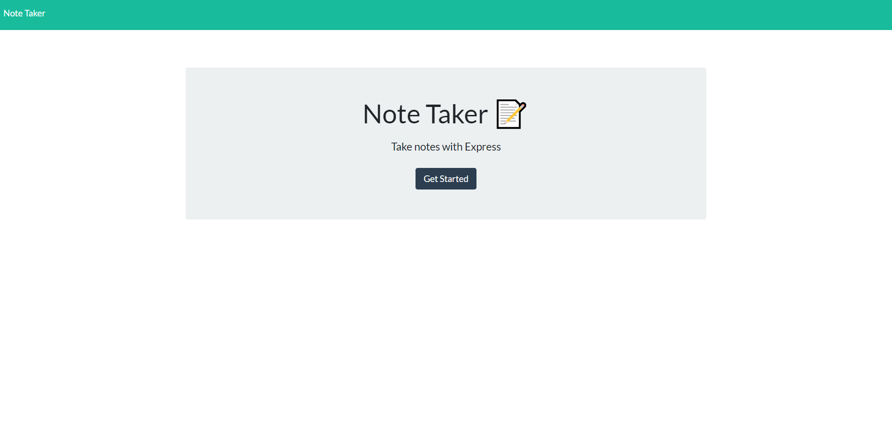

# Note Taker
## License

## Description
This App allows user to add notes, view previously entered notes and delete any notes they may have saved.

## Table of Contents
* [Installation](#installation)
* [Contributing](#contributing)
* [Deployed](#Deployed)
* [Github](#Github)
* [License](#license)
* [Username](#username)
* [Questions](#questions)
## Installation
Clone this app locally and run 'npm i', this app will run on http://localhost:3001/
## Deployed
check the app out [Here](https://note-taker-hkn.herokuapp.com/)

## Github

Check out the repository [Here](https://github.com/Father-of-Cats/Note-Taker)

## Contributing
contact me
## Username
[father-of-cats](https://www.github.com/father-of-cats)
## Questions
[huntknelson@gmail.com](huntknelson@gmail.com)
